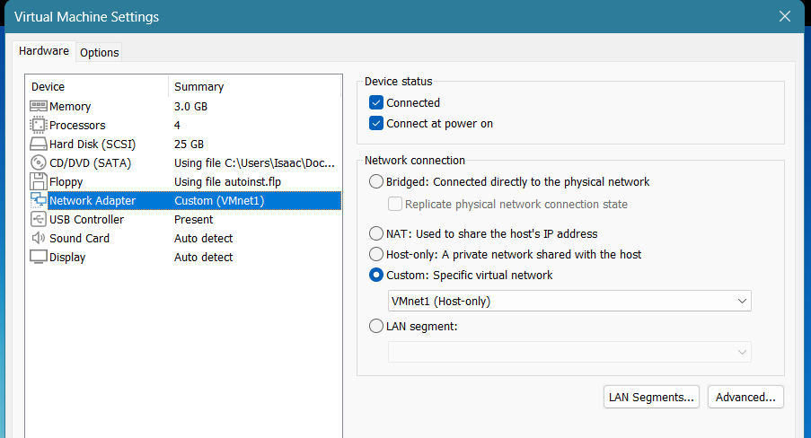
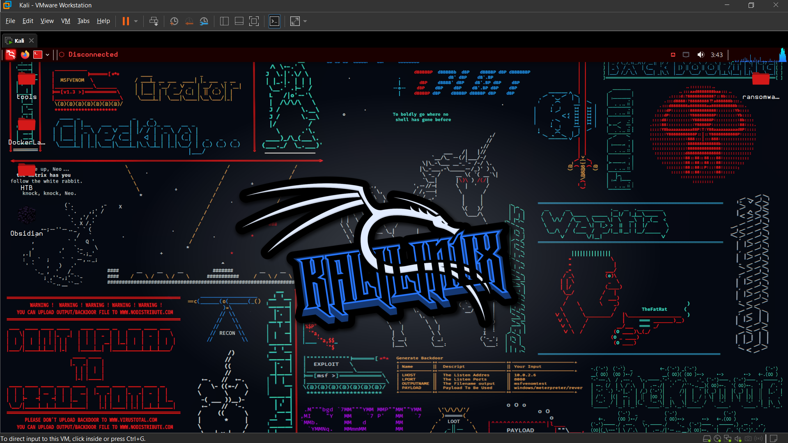
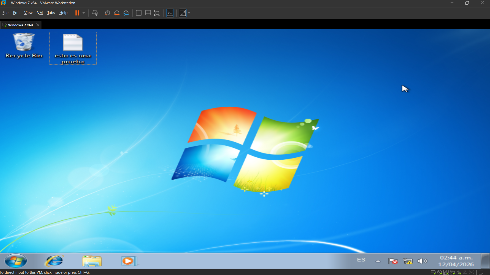
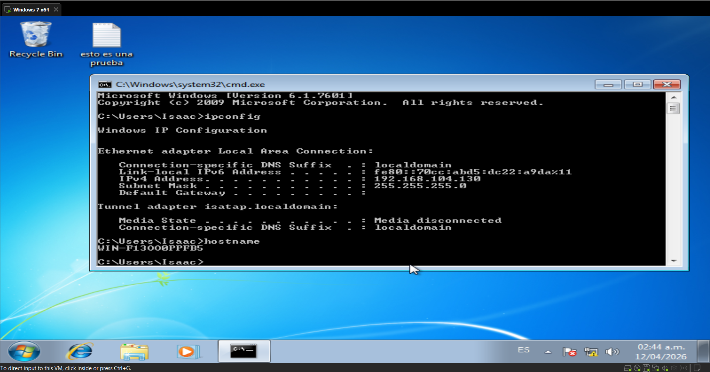

# 01 — Configuración del Entorno

## Plataforma

**VMware Workstation Pro 17**

Se utilizó VMware Workstation Pro 17 para crear y gestionar ambas máquinas virtuales. La elección de VMware frente a alternativas como VirtualBox se debe a su mayor estabilidad en redes virtuales complejas y su soporte nativo para múltiples adaptadores de red simultáneos.

---

## Red

**VMnet 1 — Host-Only — 192.168.104.0/24**

Se configuró una red de tipo Host-Only en VMware, lo que significa que ambas máquinas virtuales pueden comunicarse entre sí y con el host físico, pero no tienen acceso a internet ni a ninguna otra red externa. Esta configuración garantiza que el malware no pueda propagarse fuera del entorno de laboratorio bajo ninguna circunstancia.

---

## Máquinas Virtuales

### Equipo 1 — Atacante

| Campo | Valor |
|---|---|
| Sistema Operativo | Kali Linux |
| Dirección IP | 192.168.104.128/24 |
| Rol | Atacante |

Kali Linux instalado desde imagen ISO oficial descargada desde [kali.org](https://www.kali.org), personalizado con configuración propia. No se usó la máquina virtual preconfigurada que ofrece Offensive Security.

### Equipo 2 — Víctima

| Campo | Valor |
|---|---|
| Sistema Operativo | Windows 7 Home Basic SP1 |
| Dirección IP | 192.168.104.130/24 |
| Rol | Víctima |
| Firewall | Desactivado |
| SMBv1 | Habilitado (por defecto en Win7) |

Windows 7 instalado desde imagen ISO. El firewall fue desactivado y SMBv1 se dejó habilitado — condición por defecto en Windows 7 — para replicar el vector de ataque real de EternalBlue.

---

> 
